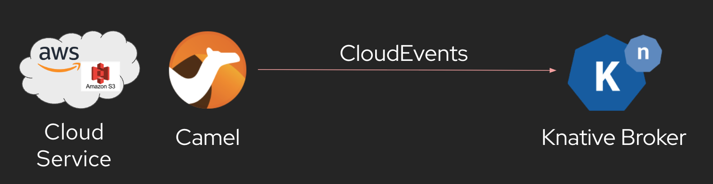

# Knative EventMesh demo

Demo shows how to use Knative eventing EventMesh connectors based on [Apache Camel Kamelets](https://camel.apache.org/camel-kamelets/).

## Event source



## Event sink


## Setup

Make sure to have a Kubernetes or OpenShift cluster with the Serverless Knative eventing installation ready.
Also, create a new Knative broker in your connected namespace.

```shell
kn broker list
```

```shell
kn trigger list
```

## Apply sources and sinks

The project uses different ways of creating Knative EventMesh sources and sinks.

You can apply the sources and sinks with your connected Kubernetes namespace using the kubectl command line tooling.

### Deployments

```shell
oc apply -f 01_deployment/log-sink/kubernetes.yml
```

```shell
oc apply -f 01_deployment/timer-source/kubernetes.yml
```

```shell
oc set env deployment/timer-source CAMEL_KAMELET_TIMER_SOURCE_MESSAGE="Camel rocks"
```

_Cleanup_
```shell
oc delete -f 01_deployment/log-sink/kubernetes.yml
```

```shell
oc delete -f 01_deployment/timer-source/kubernetes.yml
```

### ContainerSource

```shell
oc apply -f 02_containersource/timer-source/kubernetes.yml
```
_Cleanup_
```shell
oc delete -f 02_containersource/timer-source/kubernetes.yml
```

### IntegrationSink

```shell
oc apply -f 04_integrationsink/log-sink/kubernetes.yml
```

_Cleanup_
```shell
oc delete -f 04_integrationsink/log-sink/kubernetes.yml
```

### IntegrationSource

_Timer source_
```shell
oc apply -f 03_integrationsource/timer-source/kubernetes.yml
```

_AWS S3 credentials_
```shell
oc create secret generic aws-credentials-secret --from-literal=aws.accessKey=<accessKey> --from-literal=aws.secretKey=<secretKey>
```

_AWS S3 source_
```shell
oc apply -f 03_integrationsource/aws-s3-source/kubernetes.yml
```

_Cleanup_
```shell
oc delete -f 03_integrationsource/timer-source/kubernetes.yml
```

```shell
oc delete -f 03_integrationsource/aws-s3-source/kubernetes.yml
```

### Custom EventMesh connector

```shell
oc apply -f 02_containersource/star-wars-source/kubernetes.yml
```

_Cleanup_
```shell
oc delete -f 02_containersource/star-wars-source/kubernetes.yml
```
